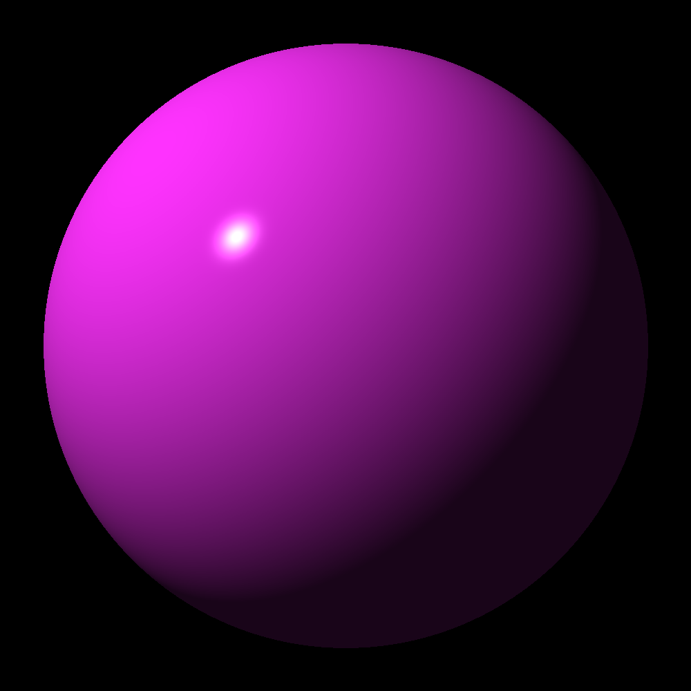
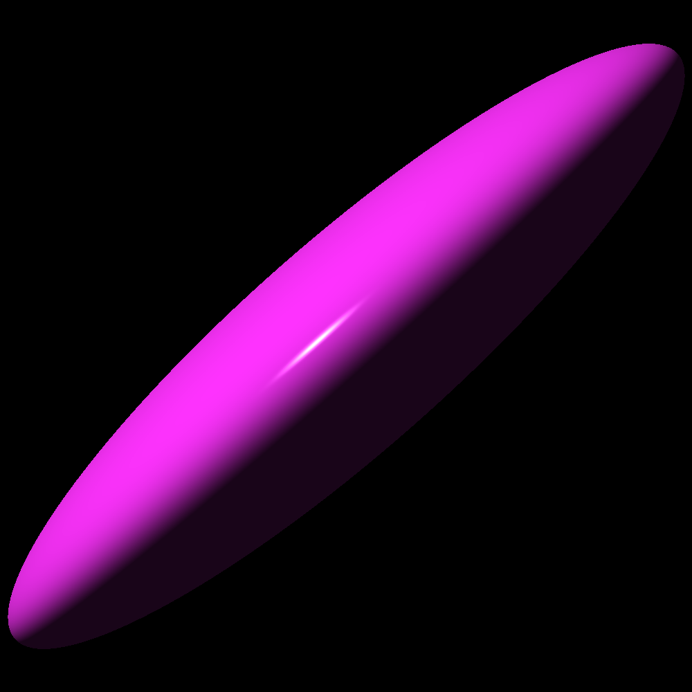
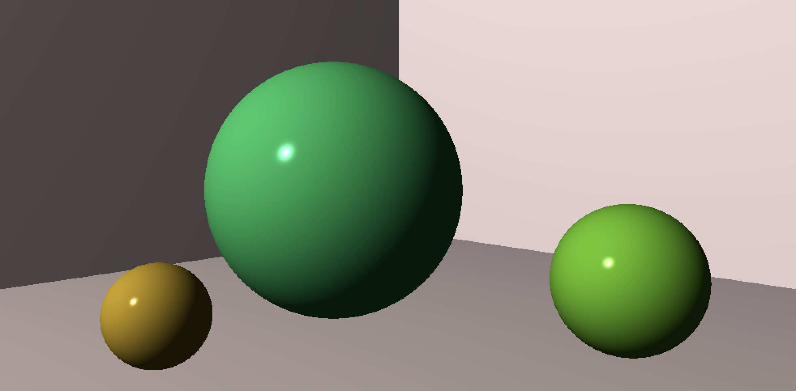

# 3D Ray Tracer 
### Implementation of the Ray tracing challenge book by James Buck

---- 

This is a C implementation of the Ray tracing challenge book. It basically simulates any scene by simulating a ray of light bouncing off of different objects untill it finally hits the canvas. 
Picking this project up to learn 
- learn c language
- test driven developement
- SOLID design patterns
- Accelerate the code using the CUDA-C library

Implementation after chapter 7
<!--  -->

Sphere after applying scaling and shearing transformations
<!--  -->

Implementation after chapter 8

